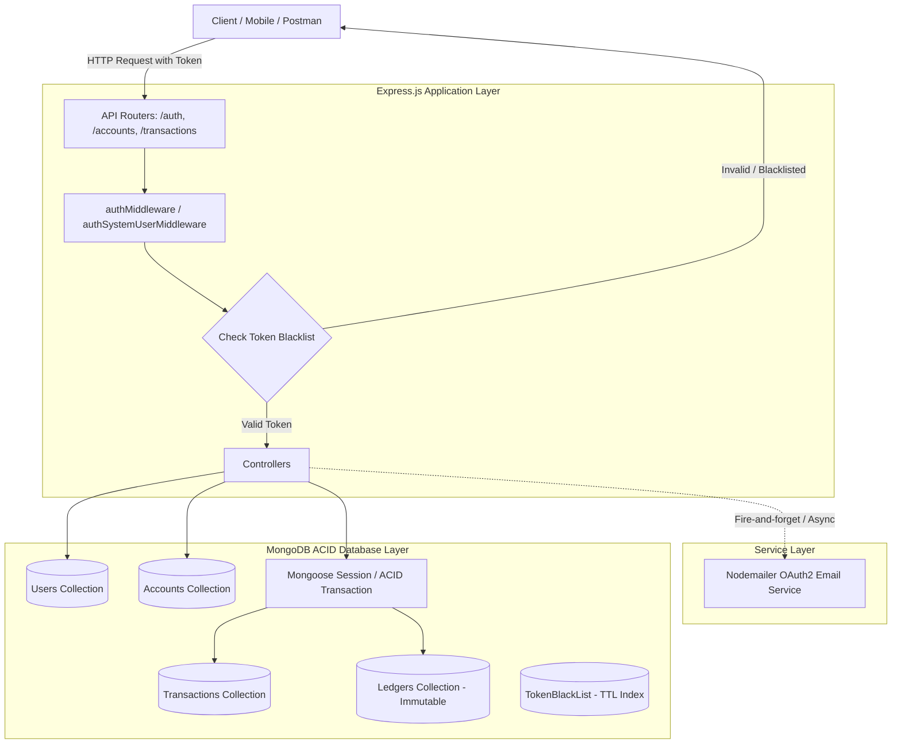
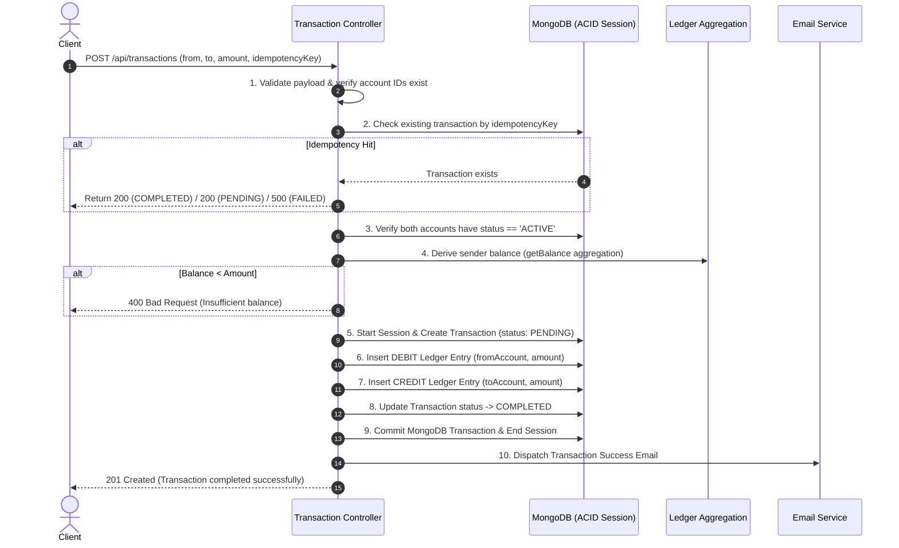
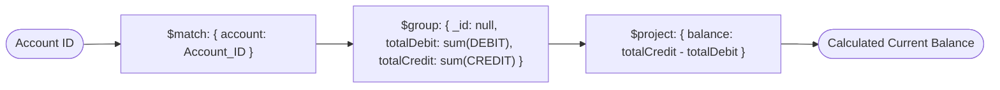
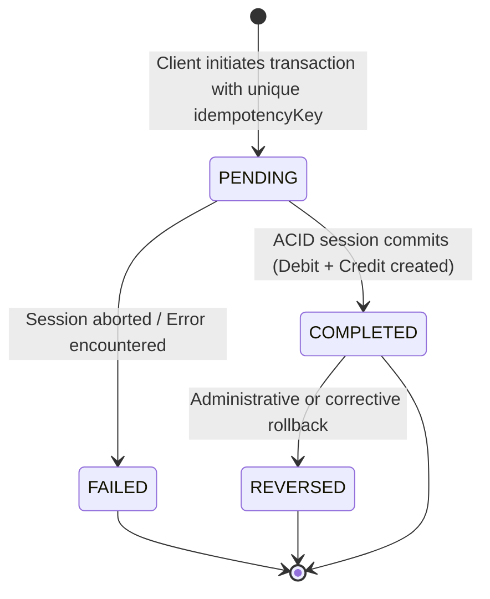

# 💰 Banking Ledger System

[](https://nodejs.org/)
[](https://expressjs.com/)
[](https://www.mongodb.com/)
[](https://mongoosejs.com/)
[](https://jwt.io/)
[](https://www.npmjs.com/package/bcryptjs)
[](https://nodemailer.com/)
[](https://opensource.org/licenses/ISC)

---

The **Banking Ledger System** is an enterprise-grade backend financial transaction engine designed to uphold strict financial integrity, complete auditability, and mathematical consistency. Built on Node.js, Express.js, and MongoDB with Mongoose, the system replaces naive, error-prone balance mutations with an **append-only, double-entry bookkeeping ledger architecture**. In this paradigm, account balances are never stored as mutable scalar numbers; instead, they are derived deterministically on-demand through high-performance aggregation pipelines across immutable debit and credit ledger entries.

Financial operations are orchestrated through a multi-phase transaction pipeline secured by **MongoDB multi-document ACID transactions** (`mongoose.startSession`). Every money movement is atomic: the sender account is debited, the receiver account is credited, and the transaction state machine updates within an isolated database session. If any operation or network call fails, the entire transaction is rolled back cleanly, eliminating partial state mutations (such as debiting a sender without crediting the receiver). Furthermore, **cryptographic idempotency keys** ensure that accidental client retries, double-clicks, and network drops never result in duplicate financial deductions.

This repository demonstrates mission-critical backend engineering principles: strict schema-level and hook-level data immutability, role-based access control (`systemUser` authorization for core reserve disbursement), dual-transport JWT authentication (supporting both HTTP-only Cookies and `Bearer` Authorization headers), automated token blacklisting backed by MongoDB TTL expiration indexes, and asynchronous transactional email notifications configured via Gmail OAuth2.

---

## 📑 Table of Contents

- [💡 Problem Statement](#-problem-statement)
- [⚡ Key Features & Architectural Differentiators](#-key-features--architectural-differentiators)
- [🚀 Quick Start](#-quick-start)
  - [Prerequisites](#prerequisites)
  - [Installation & Setup](#installation--setup)
  - [Environment Variables](#environment-variables)
- [📐 System Architecture & Diagrams](#-system-architecture--diagrams)
  - [High-Level System Architecture](#high-level-system-architecture)
  - [10-Step Transfer Sequence Flow](#10-step-transfer-sequence-flow)
  - [Dynamic Balance Derivation Pipeline](#dynamic-balance-derivation-pipeline)
- [🏦 Core Financial Subsystems](#-core-financial-subsystems)
- [🗄️ Database Schema Reference](#️-database-schema-reference)
  - [User Schema](#user-schema)
  - [Account Schema](#account-schema)
  - [Ledger Schema](#ledger-schema)
  - [Transaction Schema](#transaction-schema)
  - [Token Blacklist Schema](#token-blacklist-schema)
- [📡 API Reference](#-api-reference)
  - [Authentication Endpoints](#authentication-endpoints)
  - [Account Endpoints](#account-endpoints)
  - [Transaction Endpoints](#transaction-endpoints)
- [🔄 Transaction Lifecycle & State Machine](#-transaction-lifecycle--state-machine)
- [📊 Ledger & Balance Calculation](#-ledger--balance-calculation)
- [🔐 Authentication, Authorization & Security](#-authentication-authorization--security)
- [🔁 Idempotency & Retry-Safety](#-idempotency--retry-safety)
- [⚛️ MongoDB Atomic Transactions](#️-mongodb-atomic-transactions)
- [📂 Project Structure](#-project-structure)
- [⚠️ Error Handling & Edge Cases](#️-error-handling--edge-cases)
- [🛡️ Security Considerations](#️-security-considerations)
- [🎯 Design Decisions & Trade-offs](#-design-decisions--trade-offs)
- [🛣️ Known Behaviors & Roadmap](#️-known-behaviors--roadmap)
- [📄 Contributing & License](#-contributing--license)

---

## 💡 Problem Statement

Traditional CRUD applications frequently model user balances using a single mutable numerical field inside a database record:

```javascript
// ❌ NAIVE ANTI-PATTERN (NEVER DO THIS IN FINANCIAL SYSTEMS)
account.balance = account.balance - transferAmount;
await account.save();
```

While simple to write, this approach suffers from catastrophic structural flaws in financial contexts:

1. **The Inconsistent State Disaster ("Debit succeeds, Credit fails")**:
   ```
   [Client Transfer Request]
             │
             ▼
   Step 1: Debit Account A (-$100)  ──► [SUCCEEDS in DB]
             │
             ▼
   Step 2: Server Crash / Network Drop / Validation Failure
             │
             ▼
   Step 3: Credit Account B (+$100) ──► [FAILS / NEVER EXECUTED]
   ```
   In this scenario, $100 has vanished into thin air. Account A was charged, Account B received nothing, and the database has no historical record of why Account A lost $100.
2. **Race Conditions & Lost Updates**: Two concurrent debit requests arriving simultaneously read the same initial balance, decrement it independently, and overwrite each other's updates, allowing accounts to spend beyond their limit.
3. **Zero Auditability**: Overwriting a balance destroys the history of who transferred what, when, and under what authority. Detecting internal fraud or reconciling balance discrepancies becomes impossible.

### How This System Solves It

1. **Immutable Double-Entry Ledger**: Every financial event creates two permanent records: one `DEBIT` and one `CREDIT`. Records can **never** be edited or deleted once written.
2. **Derived Balances**: Account balances are calculated dynamically from ledger history:
   $$\text{Current Balance} = \sum(\text{CREDIT}) - \sum(\text{DEBIT})$$
3. **MongoDB Multi-Document ACID Transactions**: Debiting Account A, crediting Account B, and updating the transaction status to `COMPLETED` occur inside an atomic MongoDB session. If any sub-step fails or throws an exception, MongoDB rolls back all writes within that session. No partial balance shifts can ever commit.

---

## ⚡ Key Features & Architectural Differentiators

| Feature | Codebase Implementation | Engineering Purpose |
| :--- | :--- | :--- |
| **Derived Account Balance** | `accountSchema.methods.getBalance()` via MongoDB aggregation | Eliminates mutable balance fields; protects against race conditions and lost updates. |
| **Immutable Ledger Enforcement** | Mongoose pre-hooks on `updateOne`, `deleteOne`, `updateMany`, etc. | Guarantees an append-only audit trail; prevents unauthorized record alteration or tampering. |
| **Multi-Document ACID Transactions** | `mongoose.startSession()` with `session.startTransaction()` | Guarantees all-or-nothing execution across transactions and paired ledger entries. |
| **Cryptographic Idempotency** | Unique index on `transaction.idempotencyKey` | Prevents duplicate payments from network retries, double submissions, or timeout recoveries. |
| **Role-Based System Authorization** | `authSystemUserMiddleware` querying `user.systemUser` | Secures initial currency creation and reserve injection from standard end-user access. |
| **Dual-Transport JWT Auth** | Reads from HTTP-only `req.cookies.token` or `Authorization: Bearer <token>` | Enables flexible, secure authentication across browser clients, mobile apps, and API consumers. |
| **Automated Token Revocation (TTL)** | `tokenBlacklistSchema` with MongoDB `expireAfterSeconds: 259200` | Instantly invalidates JWTs on logout and relies on MongoDB engine to automatically purge expired tokens. |
| **Double-Entry Pairing** | Paired `DEBIT` (sender) and `CREDIT` (recipient) entries | Preserves the fundamental accounting identity across every transfer event. |
| **Transactional Email Notifications** | Asynchronous Nodemailer service backed by Google OAuth2 | Delivers real-time confirmation of user registration and money transfers without blocking client responses. |

---

## 🚀 Quick Start

### Prerequisites

- **Node.js**: `v18.0.0` or higher
- **npm**: `v9.0.0` or higher
- **MongoDB**: A running MongoDB instance supporting **Transactions** (MongoDB Replica Set or MongoDB Atlas free/paid cluster). *Note: Standalone local mongod instances without replica sets do not support multi-document transactions.*

### Installation & Setup

1. **Clone the repository**:
   ```bash
   git clone https://github.com/bhumi-31/banking-ledger-system.git
   cd banking-ledger-system
   ```

2. **Install dependencies**:
   ```bash
   npm install
   ```

3. **Configure environment variables**:
   Create a `.env` file in the root directory:
   ```bash
   touch .env
   ```
   Populate it with your database and authentication credentials:
   ```env
   PORT=3000
   MONGO_URI=mongodb+srv://<username>:<password>@cluster0.mongodb.net/backend-ledger
   JWT_SECRET=your_super_secret_cryptographic_jwt_key_here
   EMAIL_USER=your_email@gmail.com
   CLIENT_ID=your_google_oauth2_client_id
   CLIENT_SECRET=your_google_oauth2_client_secret
   REFRESH_TOKEN=your_google_oauth2_refresh_token
   ```

4. **Start the development server**:
   ```bash
   npm run dev
   ```
   *The server runs using `nodemon server.js` on port `3000` (or `process.env.PORT`).*

5. **Start in production mode**:
   ```bash
   npm start
   ```

### Environment Variables

| Variable | Required | Default | Description |
| :--- | :---: | :---: | :--- |
| `PORT` | Optional | `3000` | HTTP port on which the Express server listens. |
| `MONGO_URI` | **Required** | — | MongoDB connection string (must connect to a replica set/Atlas for transaction support). |
| `JWT_SECRET` | **Required** | — | Cryptographic secret used to sign and verify JSON Web Tokens (3-day expiry). |
| `EMAIL_USER` | **Required** | — | Gmail address used by Nodemailer to dispatch transactional emails. |
| `CLIENT_ID` | **Required** | — | Google Cloud OAuth2 Client ID for Gmail API authentication. |
| `CLIENT_SECRET` | **Required** | — | Google Cloud OAuth2 Client Secret. |
| `REFRESH_TOKEN` | **Required** | — | Google OAuth2 Refresh Token for automated token refreshing. |

---

## 📐 System Architecture & Diagrams

### High-Level System Architecture



---

### 10-Step Transfer Sequence Flow

The core transfer mechanism adheres to a 10-step protocol implemented in `src/controllers/transaction.controller.js`:



---

### Dynamic Balance Derivation Pipeline



---

## 🏦 Core Financial Subsystems

### 1. Ledger Subsystem (`src/models/ledger.model.js`)
- **Double-Entry Representation**: Stores isolated records of financial movement with references to `account`, `transaction`, `amount`, and `type` (`CREDIT` or `DEBIT`).
- **Hook-Level Immutability Enforcement**: Utilizes Mongoose query middleware pre-hooks (`findOneAndUpdate`, `updateOne`, `deleteOne`, `remove`, `deleteMany`, `updateMany`, `findOneAndDelete`, `findOneAndReplace`) to reject any modification or deletion attempt:
  ```javascript
  function preventLedgerModification() {
      throw new Error("Ledger entries are immutable nd cannot be modified or deleted");
  }
  ```

### 2. Transaction Subsystem (`src/models/transaction.model.js`, `src/controllers/transaction.controller.js`)
- Coordinates the state machine (`PENDING`, `COMPLETED`, `FAILED`, `REVERSED`).
- Governs multi-document writes across the transaction log and paired ledger entries inside MongoDB transactions.
- Enforces uniqueness on `idempotencyKey` to guarantee at-most-once execution.

### 3. Account Subsystem (`src/models/account.model.js`, `src/controllers/account.controller.js`)
- Associates a user with one or more operational bank accounts.
- Enforces an account status lifecycle (`ACTIVE`, `FROZEN`, `CLOSED`). Transactions are rejected if either account is not `ACTIVE`.
- Features an aggregation-based method `accountSchema.methods.getBalance()` that derives real-time balances without storing a persistent balance value.

### 4. Auth & Authorization Subsystem (`src/middleware/auth.middleware.js`, `src/controllers/auth.controller.js`)
- Issues signed JWTs (3-day duration) upon successful registration and password verification (via `bcrypt.compare`).
- Transports tokens via HTTP cookies and `Authorization: Bearer <token>` headers.
- Enforces role separation: standard accounts cannot invoke initial capital injections; only users with `systemUser: true` can access the `/api/transactions/system/initial-funds` endpoint.

### 5. Email Notification Subsystem (`src/services/email.service.js`)
- Uses Nodemailer configured with Google OAuth2 (`OAuth2` type, `CLIENT_ID`, `CLIENT_SECRET`, `REFRESH_TOKEN`).
- Dispatches formatted HTML and plain text notices for registration welcome, transfer confirmations, and transaction failure alerts.

---

## 🗄️ Database Schema Reference

### User Schema

Stored in `users` collection (`src/models/user.model.js`).

| Field | Type | Index | Constraints / Defaults | Description |
| :--- | :--- | :---: | :--- | :--- |
| `_id` | `ObjectId` | Primary | Auto-generated | Unique identifier for the user. |
| `email` | `String` | Unique | `required`, `trim`, `lowercase`, Regex validated | User email address used for login. |
| `name` | `String` | None | `required` | Full name of the user. |
| `password` | `String` | None | `required`, `minlength: 6`, `select: false` | Bcrypt-hashed password (salt rounds = 10). |
| `systemUser`| `Boolean` | None | `default: false`, `immutable: true`, `select: false`| Designates system administrative rights. |
| `createdAt` | `Date` | None | Auto-managed via `timestamps: true` | Record creation timestamp. |
| `updatedAt` | `Date` | None | Auto-managed via `timestamps: true` | Last update timestamp. |

---

### Account Schema

Stored in `accounts` collection (`src/models/account.model.js`).

| Field | Type | Index | Constraints / Defaults | Description |
| :--- | :--- | :---: | :--- | :--- |
| `_id` | `ObjectId` | Primary | Auto-generated | Account identifier. |
| `user` | `ObjectId` | Single / Compound | `ref: 'user'`, `required`, `index: true` | Owner user ID reference. |
| `status` | `String` | Compound | Enum: `["ACTIVE", "FROZEN", "CLOSED"]`, `default: "ACTIVE"` | Operating status of the account. |
| `currency` | `String` | None | `required`, `default: "INR"` | ISO currency designation. |
| `createdAt` | `Date` | None | Auto-managed via `timestamps: true` | Creation timestamp. |
| `updatedAt` | `Date` | None | Auto-managed via `timestamps: true` | Update timestamp. |

*Compound Indexes:*
- `{ user: 1, status: 1 }`: Optimized for querying active accounts owned by a specific user.

---

### Ledger Schema

Stored in `ledgers` collection (`src/models/ledger.model.js`).

| Field | Type | Index | Constraints / Defaults | Description |
| :--- | :--- | :---: | :--- | :--- |
| `_id` | `ObjectId` | Primary | Auto-generated | Unique ledger entry identifier. |
| `account` | `ObjectId` | Single | `ref: 'account'`, `required`, `immutable: true` | Account affected by this entry. |
| `amount` | `Number` | None | `required`, `immutable: true` | Magnitude of value moved. |
| `transaction` | `ObjectId` | Single | `ref: 'transaction'`, `required`, `immutable: true` | Related transaction identifier. |
| `type` | `String` | None | `required`, `immutable: true`, Enum: `"CREDIT"`, `"DEBIT"` | Debit or credit direction. |

---

### Transaction Schema

Stored in `transactions` collection (`src/models/transaction.model.js`).

| Field | Type | Index | Constraints / Defaults | Description |
| :--- | :--- | :---: | :--- | :--- |
| `_id` | `ObjectId` | Primary | Auto-generated | Unique transaction ID. |
| `fromAccount`| `ObjectId` | Single | `ref: 'account'`, `required`, `index: true` | Sender account reference. |
| `toAccount` | `ObjectId` | Single | `ref: 'account'`, `required`, `index: true` | Recipient account reference. |
| `amount` | `Number` | None | `required`, `min: 0` | Numerical transfer amount. |
| `status` | `String` | None | Enum: `["PENDING", "COMPLETED", "FAILED", "REVERSED"]`, `default: "PENDING"` | Lifecycle status. |
| `idempotencyKey` | `String` | Unique | `required`, `index: true`, `unique: true` | Client-provided deduplication key. |
| `createdAt` | `Date` | None | Auto-managed via `timestamps: true` | Record creation timestamp. |
| `updatedAt` | `Date` | None | Auto-managed via `timestamps: true` | Last state transition timestamp. |

---

### Token Blacklist Schema

Stored in `tokenblacklists` collection (`src/models/blackList.model.js`).

| Field | Type | Index | Constraints / Defaults | Description |
| :--- | :--- | :---: | :--- | :--- |
| `_id` | `ObjectId` | Primary | Auto-generated | Record ID. |
| `token` | `String` | Unique | `required`, `unique: true` | Invalidated JWT string. |
| `createdAt` | `Date` | TTL Index | `expireAfterSeconds: 259200` (3 days) | TTL timestamp triggering automatic document deletion. |

---

## 📡 API Reference

All requests accept JSON bodies (`Content-Type: application/json`). Authenticated routes require an active session token provided via an HTTP cookie named `token` or an `Authorization: Bearer <token>` header.

### Authentication Endpoints

#### 1. Register User
- **Endpoint**: `POST /api/auth/register`
- **Access**: Public
- **Description**: Registers a new system or client user, creates a 3-day JWT token, sets the cookie, and triggers a welcome email.
- **Request Body**:
  ```json
  {
    "name": "Jane Doe",
    "email": "jane@example.com",
    "password": "SecurePassword123",
    "systemUser": false
  }
  ```
- **Responses**:
  - `201 Created`:
    ```json
    {
      "user": {
        "_id": "664f1b2c4f1a2b0012345678",
        "email": "jane@example.com",
        "name": "Jane Doe"
      },
      "token": "eyJhbGciOiJIUzI1NiIsInR5cCI6IkpXVCJ9..."
    }
    ```
  - `422 Unprocessable Entity`: User with that email already exists.

#### 2. Login User
- **Endpoint**: `POST /api/auth/login`
- **Access**: Public
- **Description**: Verifies credentials, generates a new JWT token, and attaches it as a cookie.
- **Request Body**:
  ```json
  {
    "email": "jane@example.com",
    "password": "SecurePassword123"
  }
  ```
- **Responses**:
  - `200 OK`:
    ```json
    {
      "user": {
        "_id": "664f1b2c4f1a2b0012345678",
        "email": "jane@example.com",
        "name": "Jane Doe"
      },
      "token": "eyJhbGciOiJIUzI1NiIsInR5cCI6IkpXVCJ9..."
    }
    ```
  - `401 Unauthorized`: Email or password is invalid.

#### 3. Logout User
- **Endpoint**: `POST /api/auth/logout`
- **Access**: Authenticated
- **Description**: Invalidates the active token by writing it to the `tokenBlackListModel` and clears the `token` cookie.
- **Responses**:
  - `200 OK`:
    ```json
    {
      "message": "User logged out successfully"
    }
    ```

---

### Account Endpoints

#### 4. Create Bank Account
- **Endpoint**: `POST /api/accounts`
- **Access**: Authenticated (`authMiddleware`)
- **Description**: Creates a new bank account bound to the authenticated user ID (`req.user._id`).
- **Request Body**: Empty or `{}`
- **Responses**:
  - `201 Created`:
    ```json
    {
      "account": {
        "_id": "664f1c7d4f1a2b0012345679",
        "user": "664f1b2c4f1a2b0012345678",
        "status": "ACTIVE",
        "currency": "INR",
        "createdAt": "2026-09-17T01:00:00.000Z",
        "updatedAt": "2026-09-17T01:00:00.000Z"
      }
    }
    ```

#### 5. Get User Accounts
- **Endpoint**: `GET /api/accounts`
- **Access**: Authenticated (`authMiddleware`)
- **Description**: Retrieves all accounts belonging to the authenticated user.
- **Responses**:
  - `200 OK`:
    ```json
    {
      "accounts": [
        {
          "_id": "664f1c7d4f1a2b0012345679",
          "user": "664f1b2c4f1a2b0012345678",
          "status": "ACTIVE",
          "currency": "INR"
        }
      ]
    }
    ```

#### 6. Get Account Balance
- **Endpoint**: `GET /api/accounts/balance/:accountId`
- **Access**: Authenticated (`authMiddleware`)
- **Description**: Computes and returns the derived balance from the ledger for the specified account ID. Enforces ownership: users can only check balances for accounts they own.
- **Responses**:
  - `200 OK`:
    ```json
    {
      "accountId": "664f1c7d4f1a2b0012345679",
      "balance": 15000
    }
    ```
  - `404 Not Found`: Account does not exist or does not belong to the requesting user.

---

### Transaction Endpoints

#### 7. Execute Money Transfer
- **Endpoint**: `POST /api/transactions`
- **Access**: Authenticated (`authMiddleware`)
- **Description**: Coordinates a complete 10-step atomic transfer between two active accounts.
- **Request Body**:
  ```json
  {
    "fromAccount": "664f1c7d4f1a2b0012345679",
    "toAccount": "664f1c8e4f1a2b0012345680",
    "amount": 2500,
    "idempotencyKey": "trans-req-uuid-98765-abcd"
  }
  ```
- **Responses**:
  - `201 Created`:
    ```json
    {
      "message": "Transaction completed successfully",
      "transaction": {
        "_id": "664f1d9e4f1a2b0012345681",
        "fromAccount": "664f1c7d4f1a2b0012345679",
        "toAccount": "664f1c8e4f1a2b0012345680",
        "amount": 2500,
        "status": "COMPLETED",
        "idempotencyKey": "trans-req-uuid-98765-abcd"
      }
    }
    ```
  - `200 OK`: Idempotent replay response (e.g., `"Transaction already processed"` or `"Transaction is still processing"`).
  - `400 Bad Request`: Validation failure, accounts not active, or insufficient balance.

#### 8. Inject Initial Funds (System User Only)
- **Endpoint**: `POST /api/transactions/system/initial-funds`
- **Access**: Restricted (`authSystemUserMiddleware` - requires `systemUser: true`)
- **Description**: Disburses initial funds from the system user's internal account to a target user account within an ACID transaction session.
- **Request Body**:
  ```json
  {
    "toAccount": "664f1c7d4f1a2b0012345679",
    "amount": 50000,
    "idempotencyKey": "sys-fund-uuid-0001"
  }
  ```
- **Responses**:
  - `201 Created`:
    ```json
    {
      "message": "Initial funds transaction completed successfully",
      "transaction": {
        "_id": "664f1e1a4f1a2b0012345682",
        "fromAccount": "664f1a004f1a2b0012345600",
        "toAccount": "664f1c7d4f1a2b0012345679",
        "amount": 50000,
        "status": "COMPLETED",
        "idempotencyKey": "sys-fund-uuid-0001"
      }
    }
    ```
  - `403 Forbidden`: Requesting user is not a system user.

---

## 🔄 Transaction Lifecycle & State Machine



Every financial transaction passes through explicit lifecycle states:

1. **`PENDING`**: Initial state written to the database within the atomic session before ledger writes are finalized.
2. **`COMPLETED`**: Reached once both the `DEBIT` and `CREDIT` ledger records are confirmed and the session commits.
3. **`FAILED`**: Assigned if a transaction encounters an unrecoverable validation error, query failure, or aborted database session.
4. **`REVERSED`**: Reserved state for transactions that were executed but subsequently nullified by an opposing transaction.

---

## 📊 Ledger & Balance Calculation

The system completely rejects storing a mutable `balance` column. Instead, `accountSchema.methods.getBalance()` executes a specialized aggregation pipeline against the `ledgers` collection:

```javascript
accountSchema.methods.getBalance = async function() {
    const balanceData = await ledgerModel.aggregate([
        // Step 1: Filter all immutable ledger records for this specific account
        { $match: { account: this._id } }, 
        
        // Step 2: Sum debits and credits conditionally
        {
            $group: {
                _id: null,
                totalDebit: {
                    $sum: {
                        $cond: [
                            { $eq: ["$type", "DEBIT"] },
                            "$amount",
                            0
                        ]
                    }
                },
                totalCredit: {
                    $sum: {
                        $cond: [
                            { $eq: ["$type", "CREDIT"] },
                            "$amount",
                            0
                        ]
                    }
                }
            }
        },
        
        // Step 3: Project the computed scalar balance (Credits - Debits)
        {
            $project: {
                _id: 0,
                balance: { $subtract: ["$totalCredit", "$totalDebit"] }
            }
        }
    ]);

    if (balanceData.length === 0) {
        return 0;
    }

    return balanceData[0].balance;
};
```

### Why This Is Superior
1. **Mathematical Accuracy**: Prevents negative balance drift caused by interleaved writes.
2. **Auditing**: Every rupee or dollar ever spent is permanently attributed to a specific `transactionId` and counterpart account.
3. **Non-Repudiation**: Because ledger documents cannot be updated or deleted, logs can be used for reconciliation and financial auditing.

---

## 🔐 Authentication, Authorization & Security

### Dual-Transport Authentication (`authMiddleware`)
The authentication layer accepts tokens through two distinct transport mechanisms:
1. **HTTP-only Cookies**: Automatically read from `req.cookies.token` via `cookie-parser`.
2. **Authorization Headers**: Extracted from standard `Authorization: Bearer <token>` headers.

```javascript
const token = req.cookies.token || req.headers.authorization?.split(" ")[1];
```

### Token Invalidation & MongoDB TTL
Unlike stateless JWT implementations that cannot invalidate tokens prior to expiration, this system implements an explicit token revocation table:
- When a user logs out (`POST /api/auth/logout`), the token is saved to the `tokenBlackList` collection.
- `authMiddleware` checks incoming tokens against `tokenBlackListModel.findOne({ token })`.
- A TTL index configured with `expireAfterSeconds: 259200` ensures that MongoDB cleans up expired blacklist records automatically after 3 days, preventing memory leaks and database bloat.

### System-User Authorization (`authSystemUserMiddleware`)
To protect initial currency creation:
1. The `systemUser` flag on `userSchema` is marked with `immutable: true` and `select: false`.
2. `authSystemUserMiddleware` explicitly calls `.select("+systemUser")`.
3. If `!user.systemUser`, the request is rejected with `403 Forbidden ("Forbidden access, not a system user")`.

---

## 🔁 Idempotency & Retry-Safety

In distributed financial networks, network timeouts frequently cause clients to resend requests even though the server may have processed them. Without idempotency, this results in double debits.

This system guarantees idempotency at the database and application levels:

1. **Unique Database Constraint**: `transactionSchema` enforces a unique index on `idempotencyKey`:
   ```javascript
   idempotencyKey: {
       type: String,
       required: true,
       index: true,
       unique: true
   }
   ```
2. **Application-Level State Evaluation**: Before opening a database session, `createTransaction` inspects the state of the provided key:
   - **Status `COMPLETED`**: Returns HTTP `200 OK` with `"Transaction already processed"` and the existing transaction details.
   - **Status `PENDING`**: Returns HTTP `200 OK` with `"Transaction is still processing"`.
   - **Status `FAILED` / `REVERSED`**: Returns HTTP `500` indicating the client may generate a new key or retry.

---

## ⚛️ MongoDB Atomic Transactions

To prevent partial writes, multi-document financial updates are wrapped inside native MongoDB transaction sessions:

```javascript
const session = await mongoose.startSession();
session.startTransaction();

try {
    // 1. Create Transaction entity with status PENDING
    const transaction = (await transactionModel.create([{
        fromAccount, toAccount, amount, idempotencyKey, status: "PENDING"
    }], { session }))[0];

    // 2. Insert DEBIT ledger entry for sender
    await ledgerModel.create([{
        account: fromAccount, amount, transaction: transaction._id, type: "DEBIT"
    }], { session });

    // 3. Insert CREDIT ledger entry for receiver
    await ledgerModel.create([{
        account: toAccount, amount, transaction: transaction._id, type: "CREDIT"
    }], { session });

    // 4. Advance transaction status to COMPLETED
    await transactionModel.findOneAndUpdate(
        { _id: transaction._id },
        { status: "COMPLETED" },
        { session }
    );

    // 5. Commit all modifications atomically
    await session.commitTransaction();
    session.endSession();
} catch (error) {
    // Aborts and discards all pending writes across all collections
    await session.abortTransaction();
    session.endSession();
    throw error;
}
```

If any failure occurs between steps 1 through 4, no documents remain in either `transactions` or `ledgers`.

---

## 📂 Project Structure

```
backend-ledger/
├── .env                              # Environment configuration (DB URI, secrets, OAuth)
├── .gitignore                        # Git exclusion rules
├── package.json                      # Dependencies and npm run scripts
├── package-lock.json                 # Pinned dependency tree
├── server.js                         # Application entrypoint & DB bootstrap
└── src/
    ├── app.js                        # Express app initialization, middleware, routing
    ├── config/
    │   └── db.js                     # MongoDB Mongoose connection handler
    ├── controllers/
    │   ├── account.controller.js     # Account creation, listing, balance aggregation
    │   ├── auth.controller.js        # User signup, login, logout, cookie management
    │   └── transaction.controller.js # Transfer workflow, atomic sessions, idempotency
    ├── middleware/
    │   └── auth.middleware.js        # JWT verification, token blacklist, systemUser guard
    ├── models/
    │   ├── account.model.js          # Account schema & dynamic getBalance aggregation
    │   ├── blackList.model.js        # Invalidation blacklist schema with 3-day TTL index
    │   ├── ledger.model.js           # Immutable double-entry ledger & mutation pre-hooks
    │   ├── transaction.model.js      # Transaction schema, idempotency keys, lifecycle
    │   └── user.model.js             # User schema, bcrypt pre-save hashing, password compare
    ├── routes/
    │   ├── account.routes.js         # /api/accounts endpoint declarations
    │   ├── auth.routes.js            # /api/auth endpoint declarations
    │   └── transaction.routes.js     # /api/transactions endpoint declarations
    └── services/
        └── email.service.js          # Nodemailer Gmail OAuth2 transactional mailer
```

---

## ⚠️ Error Handling & Edge Cases

| Scenario | HTTP Status | Response Message / Handling Strategy |
| :--- | :---: | :--- |
| **Missing Request Fields** | `400` | `"FromAccount, toAccount, amount and idempotencyKey are required"` |
| **Non-Existent Accounts** | `400` | `"Invalid fromAccount or toAccount"` |
| **Inactive / Frozen Accounts** | `400` | `"Both fromAccount and toAccount must be ACTIVE to process transaction"` |
| **Insufficient Funds** | `400` | `"Insufficient balance. Current balance is X. Requested amount is Y"` |
| **Concurrent Idempotent Submission** | `200` | `"Transaction is still processing"` (while in `PENDING` state) |
| **Repeated Idempotent Submission** | `200` | `"Transaction already processed"` with existing transaction record |
| **Invalid / Expired JWT** | `401` | `"Unauthorized access, token is invalid"` or `"token is missing"` |
| **Blacklisted Token Presentation** | `401` | `"Unauthorized access, token is invalid"` |
| **Unauthorized System Route Access** | `403` | `"Forbidden access, not a system user"` |
| **Email Collision on Register** | `422` | `"User already exists with email."` |
| **Database Connection Failure** | Exit `1` | Catches connection error in `src/config/db.js` and invokes `process.exit(1)` |

---

## 🛡️ Security Considerations

1. **Password Hashing**:
   - Implemented via `bcryptjs` with salt round cost factor `10`.
   - Passwords are never saved in plain text.
   - User schema sets `password: { select: false }` to prevent accidental inclusion in projection queries.
2. **Immutable Authorization**:
   - `systemUser` has `immutable: true` and `select: false` set at the schema level. Clients cannot elevate privileges through regular update endpoints.
3. **Database-Level Immutability**:
   - Mongoose pre-hooks on the `ledger` model intercept all mutation and deletion operations, throwing an error if any update method is invoked.
4. **Credential Isolation**:
   - All connection strings, OAuth2 tokens, and signing secrets are managed through environment variables via `dotenv`.

---

## 🎯 Design Decisions & Trade-offs

### 1. Calculated Balances vs. Stored Numerical Balances
- **Decision**: Reject storing an `account.balance` scalar field; compute balances on-demand using MongoDB aggregation.
- **Benefit**: Eliminates negative balances caused by race conditions, eliminates balance drift, and provides audit trails.
- **Trade-off**: Requires an aggregation query over the ledger. In extreme high-throughput setups, this is typically paired with periodic snapshotting (e.g. daily ledger checkpoint documents).

### 2. Multi-Document Transactions vs. Two-Phase Commits
- **Decision**: Utilize MongoDB's native multi-document ACID transactions via sessions (`session.startTransaction()`).
- **Benefit**: Replaces complex distributed two-phase commit rollback code with native database rollbacks.
- **Trade-off**: Requires MongoDB to run in replica set mode (or MongoDB Atlas); cannot run on standalone local MongoDB instances.

### 3. Asynchronous Email Notifications
- **Decision**: Transmit transaction notifications via `emailService.sendTransactionEmail` after committing the database transaction.
- **Benefit**: Prevents third-party network latency (Google OAuth2/SMTP) from holding database locks or stalling the transaction commit.

---

## 🛣️ Known Behaviors & Roadmap

### Current Codebase Behaviors
- **Simulated Concurrency Delay**: In `src/controllers/transaction.controller.js` (line 133), a 15-second `setTimeout` simulation delay is deliberately included between the debit and credit creations. This demonstrates real-world long-running transfers and illustrates how the `PENDING` idempotency check handles in-flight transactions.
- **Token Blacklist Controller Import**: Note that `tokenBlackListModel` is utilized in `src/controllers/auth.controller.js` during logout. Ensure it is imported at the top of the file to maintain uniform error-free logout processing.

### Future Roadmap
- [ ] Snapshotting & Checkpointing engine for accounts with over 100,000 ledger entries.
- [ ] Multi-currency conversion service with real-time exchange rates.
- [ ] Webhook notification dispatcher for external merchant payment confirmations.
- [ ] Redis caching layer for read-only user account metadata.

---

## 📄 Contributing & License

This project is licensed under the **ISC License**.

```text
ISC License

Copyright (c) 2026 Bhumika Narula

Permission to use, copy, modify, and/or distribute this software for any
purpose with or without fee is hereby granted, provided that the above
copyright notice and this permission notice appear in all copies.

THE SOFTWARE IS PROVIDED "AS IS" AND THE AUTHOR DISCLAIMS ALL WARRANTIES
WITH REGARD TO THIS SOFTWARE INCLUDING ALL IMPLIED WARRANTIES OF
MERCHANTABILITY AND FITNESS. IN NO EVENT SHALL THE AUTHOR BE LIABLE FOR
ANY SPECIAL, DIRECT, INDIRECT, OR CONSEQUENTIAL DAMAGES OR ANY DAMAGES
WHATSOEVER RESULTING FROM LOSS OF USE, DATA OR PROFITS, WHETHER IN AN
ACTION OF CONTRACT, NEGLIGENCE OR OTHER TORTIOUS ACTION, ARISING OUT OF
OR IN CONNECTION WITH THE USE OR PERFORMANCE OF THIS SOFTWARE.
```
